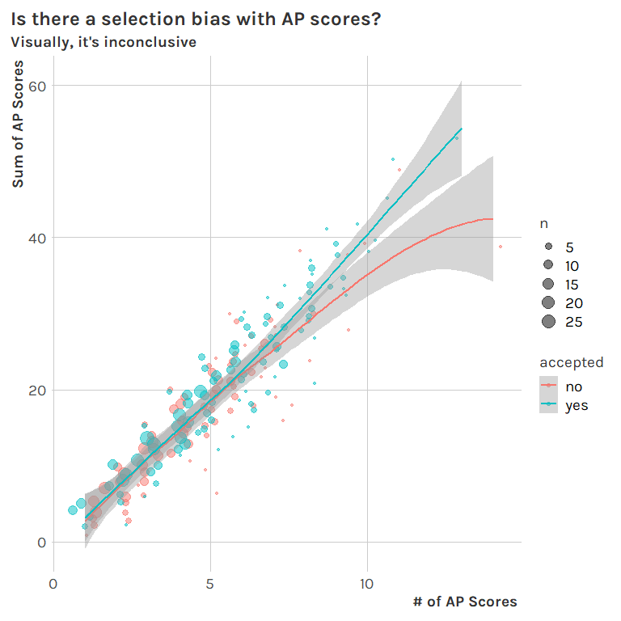

Notebook
================

Typical EDA and modeling setup. My `import` function does two pretty
notable things:

1.  Cleans the `ap_scores` columns (notably using `tidyr::separate`),
    creating `n/sum/avg_ap_score` columns.
2.  For the training set, it coerces `accepted` to a factor, which is
    expected by `{tidymodels}` for a classification task.

Notably, I used [an old blog post that I
wrote](https://tonyelhabr.rbind.io/post/nested-json-to-tidy-data-frame-r/)
to help me remember how to do the cleaning of `ap_scores`.

``` r
library(tidyverse)
library(tidymodels)
extrafont::loadfonts('win', quiet = TRUE)
library(tonythemes) # personal theme package
tonythemes::theme_set_tony()
# parallel::detectCores() # 8
doParallel::registerDoParallel(cores = 4)

import <- function(x) {
  df <-
    file.path(sprintf('%s.csv', x)) %>%
    read_csv() %>% 
    # This will be helpful for re-joining data after splitting out the `ap_scores`.
    mutate(idx = row_number()) %>% 
    relocate(idx)
  
  if(x == 'train') {
    df <-
      df %>% 
      mutate(across(accepted, ~ifelse(.x == 0, 'no', 'yes') %>% factor()))
  }
  
  # Find the max number of semicolons.
  rgx_split <- '\\;'
  n_col_max <-
    df %>% 
    pull(ap_scores) %>% 
    str_split(rgx_split) %>% 
    map_dbl(~length(.)) %>% 
    max()
  
  # Separate out columns, using the max number of semicolons.
  # Also, pivot to a tidy format and make some numberical features.
  nms_sep <- sprintf('ap_score_%02d', 1:n_col_max)
  df_sep <-
    df %>% 
    select(idx, ap_scores) %>% 
    separate(ap_scores, into = nms_sep, sep = rgx_split, fill = 'right') %>% 
    pivot_longer(
      -idx
    ) %>% 
    drop_na(value) %>% 
    group_by(idx) %>% 
    summarize(n_ap_score = n(), sum_ap_score = sum(as.integer(value))) %>% 
    ungroup() %>% 
    mutate(avg_ap_score = sum_ap_score / n_ap_score)
  df_sep
  
  res <-
    df %>% 
    select(-ap_scores) %>% 
    left_join(df_sep, by = 'idx') %>% 
    select(-idx)
  res
}

df <- import('train')
df_hold <- import('test') # I like to think of this more as a "holdout" data set.
```

`{skimr}` is almost always the first thing I do on a new data set. The
`complete.cases` line is helpful to identify the rows with NAs.

``` r
df %>% skimr::skim()
```

|                                                  |            |
|:-------------------------------------------------|:-----------|
| Name                                             | Piped data |
| Number of rows                                   | 1000       |
| Number of columns                                | 9          |
| \_\_\_\_\_\_\_\_\_\_\_\_\_\_\_\_\_\_\_\_\_\_\_   |            |
| Column type frequency:                           |            |
| character                                        | 1          |
| factor                                           | 1          |
| numeric                                          | 7          |
| \_\_\_\_\_\_\_\_\_\_\_\_\_\_\_\_\_\_\_\_\_\_\_\_ |            |
| Group variables                                  | None       |

Data summary

**Variable type: character**

| skim\_variable | n\_missing | complete\_rate | min | max | empty | n\_unique | whitespace |
|:---------------|-----------:|---------------:|----:|----:|------:|----------:|-----------:|
| ethnicity      |         49 |           0.95 |   5 |  20 |     0 |        11 |          0 |

**Variable type: factor**

| skim\_variable | n\_missing | complete\_rate | ordered | n\_unique | top\_counts       |
|:---------------|-----------:|---------------:|:--------|----------:|:------------------|
| accepted       |          0 |              1 | FALSE   |         2 | yes: 570, no: 430 |

**Variable type: numeric**

| skim\_variable  | n\_missing | complete\_rate |     mean |       sd |       p0 |      p25 |      p50 |       p75 |     p100 | hist  |
|:----------------|-----------:|---------------:|---------:|---------:|---------:|---------:|---------:|----------:|---------:|:------|
| gpa             |          0 |           1.00 |     3.71 |     0.34 |     1.98 |     3.52 |     3.83 |      4.00 |      4.0 | ▁▁▁▂▇ |
| sat             |         60 |           0.94 |  1403.14 |    92.01 |   940.00 |  1350.00 |  1410.00 |   1460.00 |   1600.0 | ▁▁▂▇▃ |
| essay\_strength |          0 |           1.00 |     2.46 |     1.10 |     0.00 |     2.00 |     2.00 |      3.00 |      5.0 | ▅▇▇▃▁ |
| family\_income  |          0 |           1.00 | 99355.24 | 32064.91 | 31138.18 | 75886.43 | 96090.09 | 120069.37 | 214573.1 | ▃▇▅▂▁ |
| n\_ap\_score    |         18 |           0.98 |     4.11 |     1.99 |     1.00 |     3.00 |     4.00 |      5.00 |     14.0 | ▇▇▂▁▁ |
| sum\_ap\_score  |         18 |           0.98 |    15.90 |     8.09 |     1.00 |    10.00 |    15.00 |     21.00 |     53.0 | ▆▇▃▁▁ |
| avg\_ap\_score  |         18 |           0.98 |     3.87 |     0.67 |     1.00 |     3.50 |     4.00 |      4.33 |      5.0 | ▁▁▃▇▆ |

``` r
df %>% filter(!complete.cases(.))
```

    ## # A tibble: 124 x 9
    ##      gpa   sat ethnicity essay_strength family_income accepted n_ap_score
    ##    <dbl> <dbl> <chr>              <dbl>         <dbl> <fct>         <int>
    ##  1  3.17  1470 <NA>                   3        98890. no                2
    ##  2  3.61    NA Asian                  3       109788. no                2
    ##  3  4     1350 <NA>                   3       143982. yes               2
    ##  4  4       NA Black                  3        99163. no                8
    ##  5  4       NA Asian                  2        86596. no                5
    ##  6  3.76  1550 Asian                  1       142969. yes              NA
    ##  7  3.46  1320 <NA>                   1        65443. no                5
    ##  8  3.54  1350 <NA>                   2        74133. yes               4
    ##  9  4     1440 <NA>                   3       136912. yes               2
    ## 10  4       NA Asian                  2       113013. no                4
    ## # ... with 114 more rows, and 2 more variables: sum_ap_score <int>,
    ## #   avg_ap_score <dbl>

Checking for disproportional `accepted`, which we’ll want to know so
that we can account for it by up/down-sampling later. It seems to be
relatively balanced, so I don’t think we’ll do anything about it.

``` r
df %>% count(accepted) %>% mutate(frac = n / sum(n))
```

    ## # A tibble: 2 x 3
    ##   accepted     n  frac
    ##   <fct>    <int> <dbl>
    ## 1 no         430  0.43
    ## 2 yes        570  0.57

`ethnicity` is the only categorical feature. We see that White, Asian,
and Black are the largest groups by far. For modeling purposes, it may
be useful to just group the rest of the groups together.

``` r
df %>% count(ethnicity, sort = TRUE) %>% mutate(frac = n / sum(n))
```

    ## # A tibble: 12 x 3
    ##    ethnicity                n  frac
    ##    <chr>                <int> <dbl>
    ##  1 White                  352 0.352
    ##  2 Asian                  265 0.265
    ##  3 Black                  226 0.226
    ##  4 <NA>                    49 0.049
    ##  5 Hispanic                27 0.027
    ##  6 NativeAmerican          24 0.024
    ##  7 Black-Hispanic-White    12 0.012
    ##  8 Asian-Hispanic          11 0.011
    ##  9 Black-Hispanic          11 0.011
    ## 10 Asian-White              9 0.009
    ## 11 Black-White              7 0.007
    ## 12 Hispanic-White           7 0.007

Here I use the [Jeffrey’s
interval](https://en.wikipedia.org/wiki/Binomial_proportion_confidence_interval#Jeffreys_interval),
which is like a Bayesian take on a confidence interval for a binomial
type of variable (`accepted`), to give some insight into the amount of
error

``` r
p_ethnicity <-
  df %>%
  group_by(ethnicity) %>%
  summarize(
    n = n(),
    n_accepted = sum(accepted == 'yes'),
    frac_accepted = n_accepted / n,
    low = qbeta(.025, n_accepted + .5, n - n_accepted + .5),
    high = qbeta(.975, n_accepted + .5, n - n_accepted + .5)
  ) %>% 
  ungroup() %>% 
  mutate(across(ethnicity, ~fct_reorder(.x, frac_accepted))) %>% 
  ggplot() +
  aes(x = frac_accepted, y = ethnicity) +
  geom_point(size = 3) +
  geom_errorbarh(position = position_dodge(width = 1), aes(xmin = low, xmax = high), height = 0.5) +
  scale_x_continuous(labels = percent) +
  theme(
    panel.grid.major.y = element_blank()
  ) +
  labs(
    title = str_wrap('How does acceptance rate differ by ethnicity? And how confident can we be in our empirical estimates?', 60),
    y = NULL,
    x = '% of Accepted'
  )
p_ethnicity
```

<!-- -->

Correlations are a quick way to get some insight into our numeric
features. `sat` and `gpa` are the most correlated features, which is not
too surprising. Nonetheless, they are not super highly correlated, so I
don’t think we really have an issue with multicollinearity (which
wouldn’t be hard to account for anyways).

``` r
df_num <- 
  df %>% 
  select(accepted, where(is.numeric)) %>% 
  # more interested in avg and n than the sum, for modeling
  select(-sum_ap_score)
df_num
```

    ## # A tibble: 1,000 x 7
    ##    accepted   gpa   sat essay_strength family_income n_ap_score avg_ap_score
    ##    <fct>    <dbl> <dbl>          <dbl>         <dbl>      <int>        <dbl>
    ##  1 no        3.40  1390              3        80115.          2         2   
    ##  2 no        3.17  1470              3        98890.          2         3.5 
    ##  3 yes       4     1400              1       120266.          3         3.67
    ##  4 no        3.61    NA              3       109788.          2         3.5 
    ##  5 no        4     1320              3        96784.          4         4.75
    ##  6 no        3.17  1410              3       113587.          1         3   
    ##  7 no        3.92  1480              1        88475.          4         4.75
    ##  8 yes       3.09  1300              1        79190.          6         2.5 
    ##  9 no        4     1430              3       103287.          4         3.5 
    ## 10 yes       3.26  1440              1       122057.          6         4.17
    ## # ... with 990 more rows

``` r
cors <-
  df_num %>%
  mutate(across(accepted, as.integer)) %>% 
  corrr::correlate(quiet = TRUE) %>% 
  pivot_longer(-term) %>% 
  rename(col1 = term, col2 = name, cor = value) %>% 
  filter(col1 != col2) %>% 
  arrange(desc(abs(cor)))
cors      
```

    ## # A tibble: 42 x 3
    ##    col1         col2           cor
    ##    <chr>        <chr>        <dbl>
    ##  1 gpa          sat          0.406
    ##  2 sat          gpa          0.406
    ##  3 sat          avg_ap_score 0.392
    ##  4 avg_ap_score sat          0.392
    ##  5 gpa          avg_ap_score 0.219
    ##  6 avg_ap_score gpa          0.219
    ##  7 accepted     gpa          0.183
    ##  8 gpa          accepted     0.183
    ##  9 accepted     sat          0.174
    ## 10 sat          accepted     0.174
    ## # ... with 32 more rows

The correlations just for `accepted`… These are relatively low across
the board, meaning that we may have some work to do. Looking at how
`gpa` and `sat` are the most highly correlated, I think we should find
that these will be the most important features in a linear model.

``` r
cors_filt <-
  cors %>% 
  filter(col1== 'accepted') %>% 
  filter(col2 != 'accepted')
cors_filt
```

    ## # A tibble: 6 x 3
    ##   col1     col2              cor
    ##   <chr>    <chr>           <dbl>
    ## 1 accepted gpa            0.183 
    ## 2 accepted sat            0.174 
    ## 3 accepted n_ap_score     0.166 
    ## 4 accepted avg_ap_score   0.146 
    ## 5 accepted family_income  0.0365
    ## 6 accepted essay_strength 0.0201

One thing I like to do with classification problems is to look at the
distributions of the features given the response variable (`accepted`).
Using percentiles for the x-axis can help prevent some distortion and
clarify differences between the “yes”/“no” distributions.

``` r
p_num <-
  df_num %>% 
  pivot_longer(-accepted) %>% 
  group_by(name) %>% 
  mutate(across(value, percent_rank)) %>% 
  ungroup() %>% 
  ggplot() +
  aes(x = value, fill = accepted) +
  geom_density(alpha = 0.5) +
  scale_x_continuous(labels = percent) +
  facet_wrap(~name, scales = 'free_y') +
  theme(
    panel.grid.major.y = element_blank(),
    axis.text.y = element_blank(),
    axis.ticks.y = element_blank(),
    legend.position = 'top'
  ) +
  labs(
    title = str_wrap('How are the distributions of numeric features different for accepted students vs. not accepted?', 60),
    y = 'Density',
    x = 'Percentile'
  )
p_num
```

<!-- -->

I was trying to see if we could learn something from the interaction of
the `n_ap_score` and `sum_ap_score` features. (Is there a self-selection
bias? People who take more tests are more likely to have higher scores?
Or maybe it’s the other way around?) To be honest, I didn’t really end
up finding anything that seemed significant from this.

``` r
p_score <-
  df %>% 
  count(n_ap_score, sum_ap_score, accepted) %>% 
  # drop_na() %>% 
  # mutate(across(matches('ap_scores'), factor)) %>% 
  ggplot() +
  aes(x = n_ap_score, y = sum_ap_score, color = accepted) +
  geom_jitter(aes(size = n), alpha = 0.5) +
  geom_smooth(method = 'loess', formula = formula(y ~ x)) +
  labs(
    title = 'Is there a selection bias with AP scores?',
    subtitle = 'Visually, it\'s inconclusive',
    x = '# of AP Scores',
    y = 'Sum of AP Scores'
  )
p_score
```

<!-- -->

Modeling setup time.

``` r
set.seed(42)
split <- df %>% initial_split(strata = accepted)
df_trn <- split %>% training()
df_tst <- split %>% testing()
folds <- df_trn %>% vfold_cv(10)

rec <-
  df_trn %>% 
  recipe(formula(accepted ~ .), data = .) %>% 
  # this will be a linear combo of n_ and avg_, so drop it
  step_rm(sum_ap_score) %>% 
  # step_indicate_na(matches('ap_score')) %>% 
  step_impute_knn(
    ethnicity, sat, n_ap_score, avg_ap_score,
    impute_with = c(
      'gpa', 'essay_strength', 'family_income'
    )
  ) %>% 
  # group non-Black and -White ethnicities into one "other" group.
  step_other(ethnicity, threshold = 0.1) %>% 
  step_dummy(ethnicity)

# quick check
jui_trn <- rec %>% prep() %>% juice()
jui_trn
```

    ## # A tibble: 749 x 10
    ##      gpa   sat essay_strength family_income n_ap_score avg_ap_score accepted
    ##    <dbl> <dbl>          <dbl>         <dbl>      <int>        <dbl> <fct>   
    ##  1  3.40  1390              3        80115.          2         2    no      
    ##  2  3.17  1470              3        98890.          2         3.5  no      
    ##  3  3.61  1392              3       109788.          2         3.5  no      
    ##  4  4     1320              3        96784.          4         4.75 no      
    ##  5  3.17  1410              3       113587.          1         3    no      
    ##  6  3.92  1480              1        88475.          4         4.75 no      
    ##  7  3.74  1340              2       114977.          7         3.29 no      
    ##  8  4     1280              2       183528.          6         3.5  no      
    ##  9  3.50  1390              2       120920.          9         3.11 no      
    ## 10  4     1460              2        68781.          4         4.75 no      
    ## # ... with 739 more rows, and 3 more variables: ethnicity_Black <dbl>,
    ## #   ethnicity_White <dbl>, ethnicity_other <dbl>

``` r
# log loss is most important imo (for probability), but let's look at several metrics
metset <- metric_set(mn_log_loss, accuracy, roc_auc)
ctrl <- control_grid(
  extract = extract_model,
  save_pred = TRUE,
  save_workflow = TRUE
)
```

Let’s start with penalized linear regression (using `{glmnet}`). Due to
the relatively simple nature of the data, this might just be all that we
need. We’ll explore gradient boosting (a tried and true out-of-the-box
solution) later.

``` r
wf_lin <-
  rec %>%
  workflow(
    logistic_reg(
      'classification',
      engine = 'glmnet',
      # mixture = tune(), # alpha in glmnet, 1 by default (lasso)
      # mixture = 0.5, # hard-code elastic net
      # mixture = 1, # lasso
      penalty = tune() # lambda in glmnet
    )
  )

grid_lin <- crossing(
  mixture = c(0, 0.25, 0.5, 0.75, 1),
  # mixture = 0.5,
  penalty = 10 ^ seq(-3, 0, .1)
)
grid_lin
```

    ## # A tibble: 155 x 2
    ##    mixture penalty
    ##      <dbl>   <dbl>
    ##  1       0 0.001  
    ##  2       0 0.00126
    ##  3       0 0.00158
    ##  4       0 0.00200
    ##  5       0 0.00251
    ##  6       0 0.00316
    ##  7       0 0.00398
    ##  8       0 0.00501
    ##  9       0 0.00631
    ## 10       0 0.00794
    ## # ... with 145 more rows

``` r
# The underlying glmnet engine seems to change lambda sets without the random seed
set.seed(42)
tune_lin <-
  wf_lin %>% 
  tune_grid(
    folds,
    metrics = metset,
    control = ctrl,
    grid = grid_lin
  )
```

``` r
tune_lin %>% 
  autoplot() + 
  theme(legend.position = 'top') +
  labs(
    title = 'Hyperparameter tuning for glmnet'
  )
```

<!-- -->

``` r
mets_lin <- tune_lin %>% collect_metrics()
mets_lin
```

    ## # A tibble: 465 x 8
    ##    penalty mixture .metric     .estimator  mean     n std_err .config           
    ##      <dbl>   <dbl> <chr>       <chr>      <dbl> <int>   <dbl> <chr>             
    ##  1 0.001         0 accuracy    binary     0.597    10  0.0266 Preprocessor1_Mod~
    ##  2 0.001         0 mn_log_loss binary     0.663    10  0.0174 Preprocessor1_Mod~
    ##  3 0.001         0 roc_auc     binary     0.620    10  0.0301 Preprocessor1_Mod~
    ##  4 0.00126       0 accuracy    binary     0.597    10  0.0266 Preprocessor1_Mod~
    ##  5 0.00126       0 mn_log_loss binary     0.663    10  0.0174 Preprocessor1_Mod~
    ##  6 0.00126       0 roc_auc     binary     0.620    10  0.0301 Preprocessor1_Mod~
    ##  7 0.00158       0 accuracy    binary     0.597    10  0.0266 Preprocessor1_Mod~
    ##  8 0.00158       0 mn_log_loss binary     0.663    10  0.0174 Preprocessor1_Mod~
    ##  9 0.00158       0 roc_auc     binary     0.620    10  0.0301 Preprocessor1_Mod~
    ## 10 0.00200       0 accuracy    binary     0.597    10  0.0266 Preprocessor1_Mod~
    ## # ... with 455 more rows

``` r
params_best_lin <- tune_lin %>% select_best('mn_log_loss')
params_best_lin
```

    ## # A tibble: 1 x 3
    ##   penalty mixture .config               
    ##     <dbl>   <dbl> <chr>                 
    ## 1  0.0316    0.25 Preprocessor1_Model047

``` r
wf_best_lin <- wf_lin %>% finalize_workflow(params_best_lin)
# Ugh, not working for some reason...
# fit_trn_lin <- wf_lin %>% fit(df_trn)
# fit_lin <- wf_lin %>% fit(df)

# Do this instead as a fix
wf_lin_fix <-
  rec %>%
  workflow(
    logistic_reg(
      'classification',
      engine = 'glmnet',
      penalty = params_best_lin$penalty, 
      mixture = params_best_lin$mixture
    )
  )

fit_trn_lin <- wf_lin_fix %>% fit(df_trn) # use this to evaluate validation set.
fit_lin <- wf_lin_fix %>% fit(df) # use this for true holdout data
```

Feature importances, a.k.a. coefficient estimates (since this is a
linear model), are always great to look at. Notably, we see that `gpa`
is the most important, but we don’t see that `sat` is as important.
Recall that these were the 2 most correlated features with `accepted`.
However, they were also somewhat correlated with one another (\~0.5), so
perhaps it’s not all that surprising to see that one of the two is
treated with less importance by a regularized regression.

``` r
imp_lin <-
  fit_lin %>% 
  extract_fit_engine() %>% 
  vip::vi(
    method = 'model', 
    lambda = params_best_lin$penalty, 
    alpha = params_best_lin$mixture
  ) %>% 
  set_names(c('feature', 'imp', 'sign')) %>% 
  mutate(across(feature, ~fct_reorder(.x, imp))) %>% 
  ggplot() +
  aes(x = imp, y = feature, fill = sign) +
  geom_col() +
  labs(
    title = 'glmnet feature importance',
    y = NULL,
    x = 'Coefficient'
  ) +
  theme(
    panel.grid.major.y = element_blank()
  )
imp_lin
```

<!-- -->

Get predictions for holdout set (“test.csv”).

``` r
# Save these for potential exporting, after checking how good xgboost is
preds_hold_lin <-
  fit_lin %>% 
  predict(df_hold) %>% 
  rename(accepted = .pred_class)
preds_hold_lin
```

    ## # A tibble: 1,000 x 1
    ##    accepted
    ##    <fct>   
    ##  1 no      
    ##  2 yes     
    ##  3 yes     
    ##  4 yes     
    ##  5 no      
    ##  6 yes     
    ##  7 yes     
    ##  8 yes     
    ##  9 yes     
    ## 10 no      
    ## # ... with 990 more rows

Evaluate on validation set.

``` r
probs_tst_lin <- 
  fit_trn_lin %>% 
  augment(
    df_tst, 
    penalty = params_best_lin$penalty, 
    mixture = params_best_lin$mixture,
    type = 'prob'
  )

preds_tst_lin <- fit_trn_lin %>% augment(df_tst)

preds_tst_lin %>% 
  accuracy(.pred_class, accepted)
```

    ## # A tibble: 1 x 3
    ##   .metric  .estimator .estimate
    ##   <chr>    <chr>          <dbl>
    ## 1 accuracy binary         0.653

``` r
preds_tst_lin %>% 
  conf_mat(.pred_class, accepted) %>% 
  autoplot('heatmap') +
  labs(
    title = 'Confusion matrix for glmnet'
  )
```

<!-- -->

``` r
# 'first' event level is the "no" class.
probs_tst_lin %>% 
  mn_log_loss(accepted, .pred_no, event_level = 'first')
```

    ## # A tibble: 1 x 3
    ##   .metric     .estimator .estimate
    ##   <chr>       <chr>          <dbl>
    ## 1 mn_log_loss binary         0.629

``` r
probs_tst_lin %>% 
  roc_curve(accepted, .pred_no) %>% 
  autoplot() +
  tonythemes::theme_tony() +
  labs(
    title = 'ROC AUC for glmnet'
  )
```

<!-- -->

Now let’s follow the same process, but with `{xgboost}`.

``` r
wf_xg <-
  rec %>%
  # could definitely tune more here, but whatever
  workflow(
    boost_tree(
      'classification',
      engine = 'xgboost',
      trees = tune(),
      mtry = tune(),
      learn_rate = tune()
    )
  )

n_col_jui <- ncol(jui_trn)
# Regular grid, to make visual interpretation easier
# Actually had higher number of trees to begin with, but found that lower tended to better, so adjusted.
grid_xg <- crossing(
  trees = c(1, 5, 10, 25, 50, 75, 100),
  mtry = seq.int(2, n_col_jui, by = 2),
  learn_rate = c(0.01, 0.02, 0.03)
)
```

``` r
tune_xg %>% 
  autoplot() + 
  theme(legend.position = 'top') +
  labs(
    title = 'Hyperparameter tuning for xgboost'
  )
```

<!-- -->

``` r
params_best_xg <- tune_xg %>% select_best('mn_log_loss')
params_best_xg
```

    ## # A tibble: 1 x 4
    ##    mtry trees learn_rate .config               
    ##   <dbl> <dbl>      <dbl> <chr>                 
    ## 1     2    25       0.03 Preprocessor1_Model018

``` r
wf_best_xg <- wf_xg %>% finalize_workflow(params_best_xg)
# Yay this pattern works for the xgboost model
fit_trn_xg <- wf_best_xg %>% fit(df_trn)
```

    ## [12:16:33] WARNING: amalgamation/../src/learner.cc:1095: Starting in XGBoost 1.3.0, the default evaluation metric used with the objective 'binary:logistic' was changed from 'error' to 'logloss'. Explicitly set eval_metric if you'd like to restore the old behavior.

``` r
fit_xg <- wf_best_xg %>% fit(df)
```

    ## [12:16:33] WARNING: amalgamation/../src/learner.cc:1095: Starting in XGBoost 1.3.0, the default evaluation metric used with the objective 'binary:logistic' was changed from 'error' to 'logloss'. Explicitly set eval_metric if you'd like to restore the old behavior.

Feature importances… we shouldn’t expect these to be the same as those
from glmnet.

``` r
imp_xg <-
  fit_xg %>% 
  extract_fit_engine() %>% 
  # xgboost::xgb.importance() %>% # not working for some reason, ugh
  vip::vi(type = 'gain') %>% 
  set_names(c('feature', 'imp')) %>% 
  # arrange(desc(imp)) %>% 
  mutate(across(feature, ~fct_reorder(.x, imp))) %>% 
  ggplot() +
  aes(x = imp, y = feature) +
  geom_col() +
  labs(
    title = 'xgboost Feature Importance',
    y = NULL,
    x = 'Coefficient'
  ) +
  theme(
    panel.grid.major.y = element_blank()
  )
imp_xg
```

<!-- -->

Evaluation time again. We find that the tuned xgboost is slightly worse
than glmnet across all evaluation metrics.

``` r
probs_tst_xg <- fit_trn_xg %>% augment(df_tst, type = 'prob')
preds_tst_xg <- fit_trn_xg %>% augment(df_tst)
preds_tst_xg %>% 
  accuracy(.pred_class, accepted)
```

    ## # A tibble: 1 x 3
    ##   .metric  .estimator .estimate
    ##   <chr>    <chr>          <dbl>
    ## 1 accuracy binary         0.618

``` r
preds_tst_lin %>% 
  conf_mat(.pred_class, accepted) %>% 
  autoplot('heatmap') +
  labs(
    title = 'Confusion matrix for xgboost'
  )
```

<!-- -->

``` r
# 'first' event level is the "no" class.
probs_tst_xg %>% 
  mn_log_loss(accepted, .pred_no, event_level = 'first')
```

    ## # A tibble: 1 x 3
    ##   .metric     .estimator .estimate
    ##   <chr>       <chr>          <dbl>
    ## 1 mn_log_loss binary         0.662

``` r
# This is slightly worse than the linear model
probs_tst_xg %>% 
  roc_curve(accepted, .pred_no) %>% 
  autoplot() +
  tonythemes::theme_tony() +
  labs(
    title = 'ROC AUC for xgboost'
  )
```

<!-- -->

We could do some ensembling here. Perhaps the xgboost model captures
some things that the penalized regression does not. However, I’m just
about at the end of my time. Let’s use the glmnet predictions.

``` r
write_csv(preds_hold_lin, file.path('preds.csv'))
```
